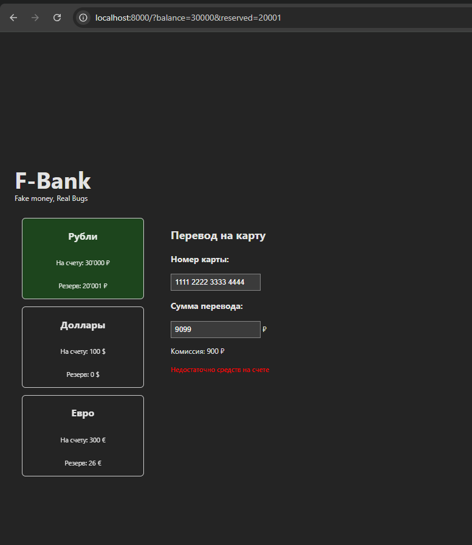
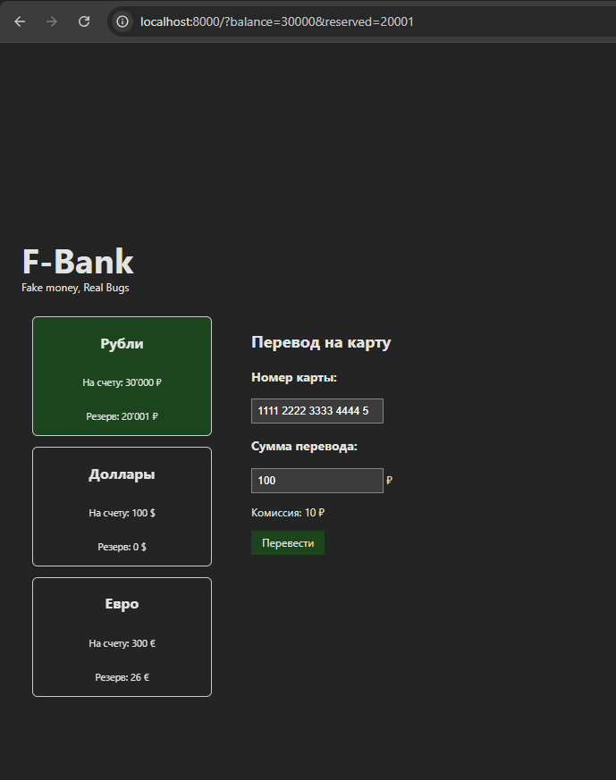
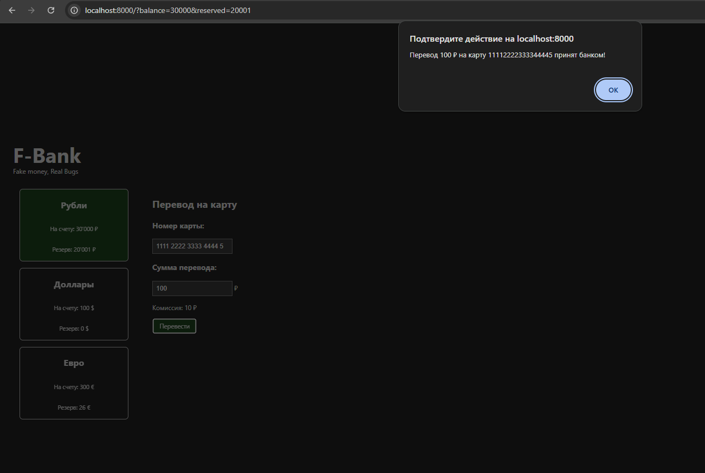
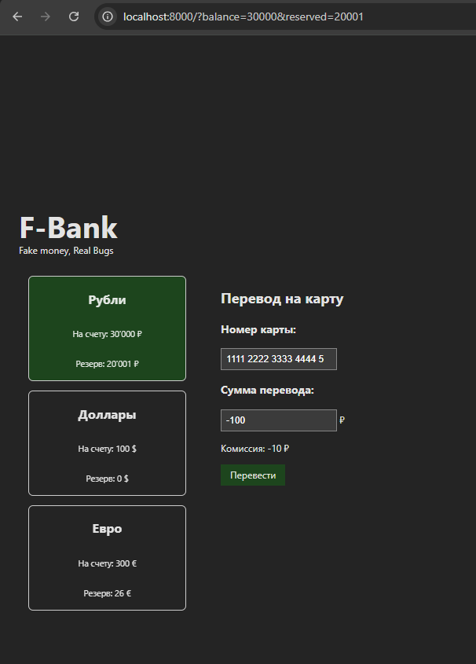
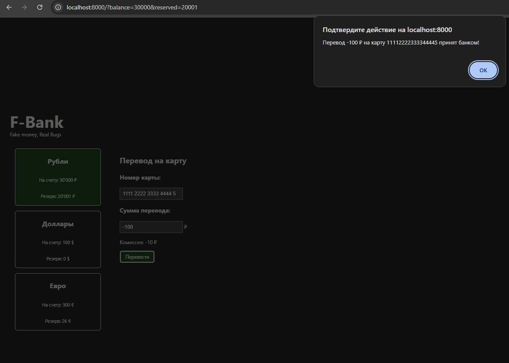

# Баг-репорты

---

## BR-01 Перевод невозможен при граничном значении суммы

**Серьёзность:** Major  
**Приоритет:** High  

### Предусловия
Открыть:

http://localhost:8000/?balance=30000&reserved=20001

Доступная сумма = 9999

---

### Шаги
1. Нажать "Рубли"
2. Ввести карту: 1111222233334444
3. Ввести сумму: 9099

---

### Ожидаемый результат
Комиссия = 900  
Общая сумма = 9999  

Перевод должен быть возможен (сумма не превышает доступную)

---

### Фактический результат
Появляется сообщение:
"Недостаточно средств на счете"

Кнопка "Перевести" отсутствует

---

### Скриншот

---

### Результат
Перевод ошибочно запрещён

---

## BR-02 Принимается номер карты длиной 17 цифр

**Серьёзность:** Major  
**Приоритет:** High  

---

### Шаги
1. Нажать "Рубли"
2. Ввести карту: 11112222333344445 (17 цифр)

---

### Ожидаемый результат
Номер карты должен считаться невалидным  
Переход к вводу суммы невозможен  

---

### Фактический результат
Появляется поле суммы  
Можно продолжить перевод  

---

### Скриншот

---

### Результат
Валидация карты работает некорректно

---

## BR-03 Разрешён ввод отрицательной суммы

**Серьёзность:** Major  
**Приоритет:** Medium  

---

### Шаги
1. Нажать "Рубли"
2. Ввести карту: 1111222233334444
3. Ввести сумму: -100

---

### Ожидаемый результат
Отрицательная сумма должна быть запрещена  

---

### Фактический результат
Поле принимает отрицательное значение  

---

### Скриншот

---

### Результат
Отсутствует валидация суммы перевода