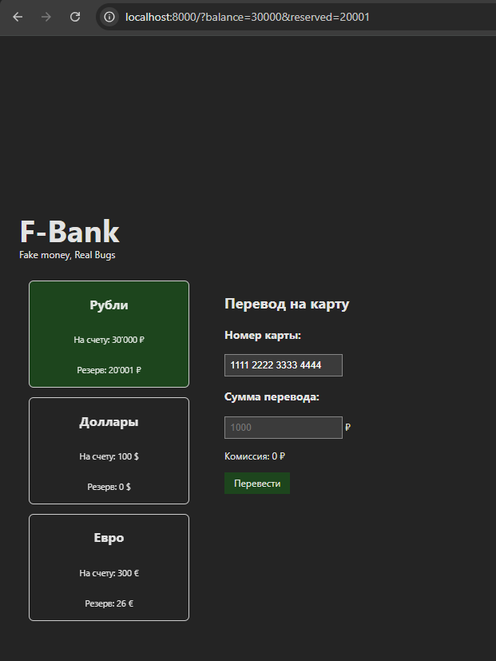

# Баг-репорты

---

## BR-01. Некорректный расчёт комиссии за перевод

**ID:** BR-01  
**Название:** Комиссия за перевод рассчитывается некорректно для суммы `9090 ₽`  
**Серьёзность:** Major  
**Приоритет:** High  
**Тип дефекта:** Ошибка бизнес-логики / некорректный расчёт комиссии

### Окружение
- Браузер: Google Chrome
- Способ запуска: локально через `python3 -m http.server 8000`
- URL: `http://localhost:8000/?balance=30000&reserved=20001`

### Предусловия
- Баланс счёта: `30000`
- Резерв: `20001`
- Доступная сумма: `9999`

### Шаги воспроизведения
1. Открыть приложение.
2. Нажать кнопку **«Рубли»**.
3. Ввести номер карты: `1111222233334444`.
4. Ввести сумму перевода: `9090`.

### Ожидаемый результат
- Комиссия должна рассчитываться как `10%` от суммы перевода с округлением вниз.
- Для суммы `9090 ₽` комиссия должна составлять:

```text
9090 × 0.1 = 909 ₽
```

- На экране должна отображаться комиссия: `909 ₽`.
- Так как сумма перевода с комиссией равна доступной сумме:

```text
9090 + 909 = 9999 ₽
```

- Перевод должен быть доступен.
- Должна отображаться кнопка **«Перевести»**.

### Фактический результат
- На экране отображается комиссия: `900 ₽`.
- Кнопка **«Перевести»** отображается.
- Фактический расчёт комиссии не соответствует требованиям приложения.

### Скриншот


### Итог
Система некорректно рассчитывает комиссию за перевод и отображает неверное значение комиссии для суммы `9090 ₽`.

---

## BR-02. Принимается номер карты длиной 17 цифр

**ID:** BR-02  
**Название:** Поле суммы отображается при вводе номера карты длиной более 16 цифр  
**Серьёзность:** Major  
**Приоритет:** High  
**Тип дефекта:** Ошибка валидации пользовательского ввода

### Окружение
- Браузер: Google Chrome
- Способ запуска: локально через `python3 -m http.server 8000`
- URL: `http://localhost:8000/?balance=30000&reserved=20001`

### Предусловия
Приложение открыто и доступно для ввода данных перевода.

### Шаги воспроизведения
1. Открыть приложение.
2. Нажать кнопку **«Рубли»**.
3. Ввести номер карты: `11112222333344445` (17 цифр).

### Ожидаемый результат
- Номер карты должен считаться невалидным.
- Переход к следующему шагу должен быть заблокирован.
- Поле ввода суммы не должно отображаться.

### Фактический результат
- Поле ввода суммы отображается.
- Пользователь может продолжить оформление перевода.

### Скриншоты
  


### Итог
Система некорректно валидирует длину номера карты и принимает значение, не соответствующее требованиям.

---

## BR-03. Разрешён ввод отрицательной суммы перевода

**ID:** BR-03  
**Название:** Поле суммы перевода принимает отрицательное значение  
**Серьёзность:** Major  
**Приоритет:** Medium  
**Тип дефекта:** Ошибка валидации пользовательского ввода / бизнес-логики

### Окружение
- Браузер: Google Chrome
- Способ запуска: локально через `python3 -m http.server 8000`
- URL: `http://localhost:8000/?balance=30000&reserved=20001`

### Предусловия
Приложение открыто и пользователь перешёл к вводу данных перевода.

### Шаги воспроизведения
1. Открыть приложение.
2. Нажать кнопку **«Рубли»**.
3. Ввести номер карты: `1111222233334444`.
4. Ввести сумму перевода: `-100`.
5. Проверить доступность кнопки «Перевести».

### Ожидаемый результат
- Отрицательная сумма должна считаться невалидной.
- Кнопка **«Перевести»** не должна отображаться.
- Пользователь не должен иметь возможность выполнить перевод с отрицательной суммой.

### Фактический результат
- Отображается кнопка «Перевести».
- Поле суммы принимает отрицательное значение.
- Отрицательная сумма не блокируется системой.
- Пользователь может продолжить сценарий перевода.

### Скриншоты
  


### Итог
В приложении отсутствует корректная валидация суммы перевода, что позволяет вводить отрицательные значения.

---

## BR-04. Кнопка перевода отображается без ввода суммы

**ID:** BR-04  
**Название:** Кнопка перевода появляется без ввода суммы перевода  
**Серьёзность:** Major  
**Приоритет:** High  
**Тип дефекта:** Ошибка валидации пользовательского ввода / бизнес-логики

### Окружение
- Браузер: Google Chrome
- Способ запуска: локально через `python3 -m http.server 8000`
- URL: `http://localhost:8000/?balance=30000&reserved=20001`

### Предусловия
Приложение открыто и пользователь перешёл к вводу данных перевода.

### Шаги воспроизведения
1. Открыть приложение.
2. Нажать кнопку **«Рубли»**.
3. Ввести номер карты: `1111222233334444`.
4. Не вводить сумму перевода.

### Ожидаемый результат
- До ввода суммы кнопка **«Перевести»** не должна отображаться.
- Пользователь не должен иметь возможность перейти к выполнению перевода без указания суммы.

### Фактический результат
- Кнопка **«Перевести»** отображается без ввода суммы.
- Пользователь может продолжить сценарий перевода, не указав сумму.

### Скриншот


### Итог
В приложении отсутствует корректная проверка обязательности поля суммы перевода.